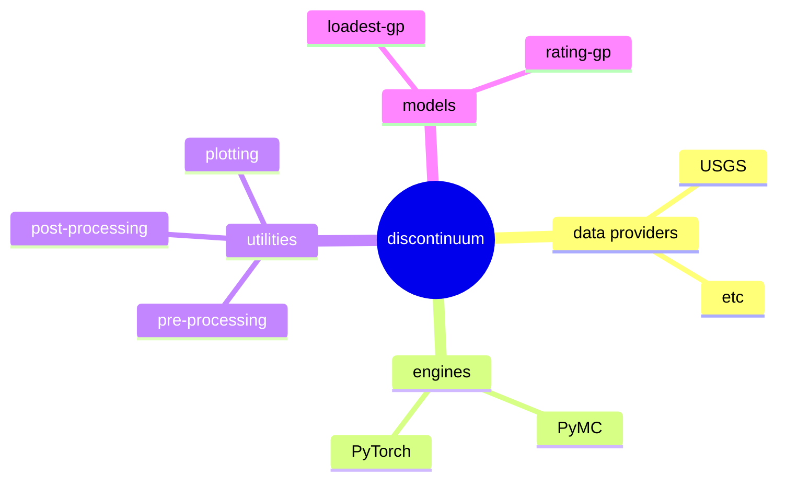

# discontinuum


> [!WARNING]  
> Experimental.

## Overview
`discontinuum` is a middleware for developing Gaussian process (GP) models.
Why might we want a middleware? 
GP's are a flexible and elegant approach to modeling dynamical systems
for which we have sparse and uncertain observations.
In this arena, simple GP models, specified in several lines of math,
can often achieve state-of-the-art predictive performance.
However, fitting GP's is numerically intense, $\mathcal{O}(n^3)$ complexity.
They have several optimizations that take advantage of simplifying assumptions,
different algorithms, or GPUs, but each has tradeoffs.
Ideally, we could quickly write mathematical models, then run them on whichever
"engine" is best suited for a particular problem.

Furthermore, most models include a lot of relatively standard utility functions
for plotting, managing metadata, data pre-processing, and other "boiler plate."
`discontinum` packages engines and utilities within a single ecosystem,
such that creating a new model is just a matter of writing a little math without 
too much boilerplate.

## Installation
```
pip install discontinuum
```

## Models

### loadset-gp
`loadest-gp` is Gaussian-process model for estimating river constituent time series,
which borrows its namesake from the venerable LOAD ESTimator (LOADEST) software program.
However, LOADEST has several serious limitations
---it's essentially a linear regression---and it has been all but replaced by
the more flexible Weighted Regression on Time Discharge and Season (WRTDS),
which allows the relation between target and covariate to vary through time.
`loadest-gp` takes the WRTDS idea and reimplements it as a GP.
Try it out in the [loadest-gp demo](https://github.com/thodson-usgs/discontinuum/blob/main/notebooks/loadest-gp-demo.ipynb).

### rating-gp
`rating-gp` is a Gaussian-process model for estimate river flow from stage time series.
Try it out in the [rating-gp demo](https://github.com/thodson-usgs/discontinuum/blob/main/notebooks/rating-gp-demo.ipynb).

## Engines
Currently, the only supported engines are the marginal likelihood implementation in `pymc` and `gpytorch`.
Latent GP implementations could be added in the future.
In general, the `gpytorch` implementation is faster and provides a lot a powerful features,
like GPU support, whereas `pymc` is a more complete probabilistic-programming framework,
which can be "friendlier" for certain use cases.


## Roadmap

