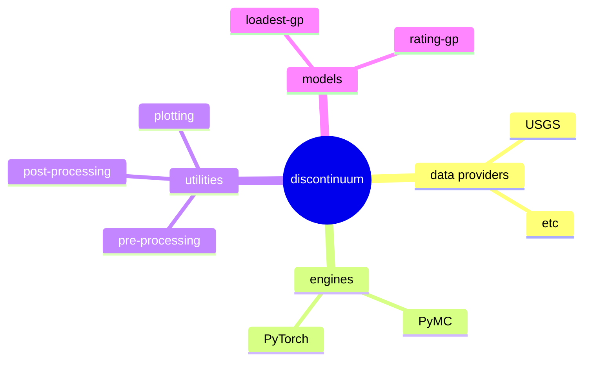

# discontinuum
> [!WARNING]  
> Experimental.

## Overview
`discontinuum` is a middleware for developing Gaussian process (GP) models.
GP's are an elegant way to model spatial or timeseries with uncertainty,
particularly when measurements of the target are very sparse but we have some
easy-to-measure and continuous surrogate. This pattern is extremely common in
Earth science, which is why GPs are widely used within that community (Kriging,
for example). Streamflow data falls into this category. USGS operates thousands
of streamgauges. Nearly all measure a surrogate like water-height and
use that to predict flow based on occasional flow measurments.

In many cases, we can represent powerful GP models with only a few lines of
math. However, fitting GP's is numerically intense, $\mathcal{O}(n^3)$
complexity. There are several optimizations that take advantage of simplifying
assumptions, different algorithms, or GPUs, but each has different tradeoffs.
Ideally, we could quickly write mathematical models, then run them on whichever
"engine" is best suited for a particular problem.

Furthermore, many models include a lot of relatively standard utility functions,
such as for plotting, managing metadata, or data pre-processing like
standardization or transformation. The goal of `discontinum` is to serve as a
middleware for these cases by packaging different engines and utilities within a
single ecosystem, such that creating a new model is just a matter of writing a
few lines of math without hundreds of lines of modeling boilerplate.  With every
model comes a lot of standard utility functions, and the goal of `discontinuum`
is to package these different model applications, engines, and utilities into a
single ecosystem.

## Installation
```
pip install discontinuum
```

## Models

### loadset-gp
`loadest-gp` is Gaussian-process model for estimating river constituent
timeseries, which borrows its namesake from the venerable LOAD ESTimator
(LOADEST) software program.  However, LOADEST has several serious
limitations---it's essentially a linear regression--- and it has been all but
replaced by the more flexible Weighted Regression on Time Discharge and Season
(WRTDS), which allows the relation between target and covariate to vary through
time.  `loadest-gp` takes the WRTDS idea and reimplements it as a GP.
Try it out in the [loadest-gp demo](https://github.com/thodson-usgs/discontinuum/blob/main/notebooks/loadest-gp-demo.ipynb).

### rating-gp
`rating-gp` is a Gaussian-process model for estimate river flow from stage timeseries.
Try it out in the [rating-gp demo](https://github.com/thodson-usgs/discontinuum/blob/main/notebooks/loadest-gp-demo.ipynb).

## Engines
Currently, the only supported engines are the marginal likelihood implementation
in `pymc` and `gpytorch`.  Latent GP implementations could be added in the
future.  In general, the `gpytorch` implementation is faster and provides a lot
a powerful features, like GPU support, whereas `pymc` is a more complete
probabilistic-programming framework, which is easier for certain use cases.


## Roadmap

