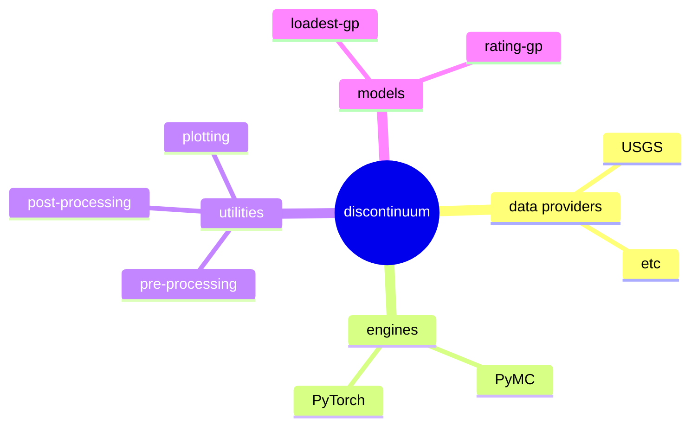

# discontinuum


> [!WARNING]  
> Experimental.

## Overview
`discontinuum` is a middleware for developing Gaussian process (GP) models.

GP's are a flexible approach to machine learning,
which are naturally suited for applications with sparse and noisy data
or for uncertainty analysis.
However, fitting GP's is numerically expensive,
which has led to a range of optimizations with different tradeoffs.
Ideally, we could quickly write mathematical models, then run them on whichever
"engine" is best suited for a particular problem.

Most model applications also include a fair amount of "boiler plate"
in the form of utility functions for plotting, managing metadata, data pre-processing, etc.
`discontinum` packages several engines and helper utilities into a single ecosystem
to simplify the processes of prototyping GP models.

## Installation
```
pip install discontinuum
```

## Models

### loadset-gp
`loadest-gp` is Gaussian-process model for estimating river constituent time series,
which borrows its namesake from the venerable LOAD ESTimator (LOADEST) software program.
However, LOADEST has several serious limitations
---it's essentially a linear regression---and it has been all but replaced by
the more flexible Weighted Regression on Time Discharge and Season (WRTDS),
which allows the relation between target and covariate to vary through time.
`loadest-gp` takes the WRTDS idea and reimplements it as a GP.
github/thodson-usgs/discontinuum/blob/main/docs/source/notebooks/loadest-gp-demo.ipynb
Try it out in the [loadest-gp demo](https://github.com/thodson-usgs/discontinuum/blob/main/docs/source/notebooks/loadest-gp-demo.ipynb).

### rating-gp
`rating-gp` is a Gaussian-process model for estimating river flow from stage time series.
Try it out in the [rating-gp demo](https://github.com/thodson-usgs/discontinuum/blob/main/docs/source/notebooks/rating-gp-demo.ipynb).

## Engines
Currently, the only supported engines are the marginal likelihood implementation in `pymc` and `gpytorch`.
Latent GP implementations could be added in the future.
In general, the `gpytorch` implementation is faster and provides a lot a powerful features,
like GPU support, whereas `pymc` is a more complete probabilistic-programming framework,
which can be "friendlier" for certain use cases.

Porting a model from one engine to another usually involves completely rewriting the guts of the GP.
but any other boiler-plate functions should be unaffected.


## Roadmap

