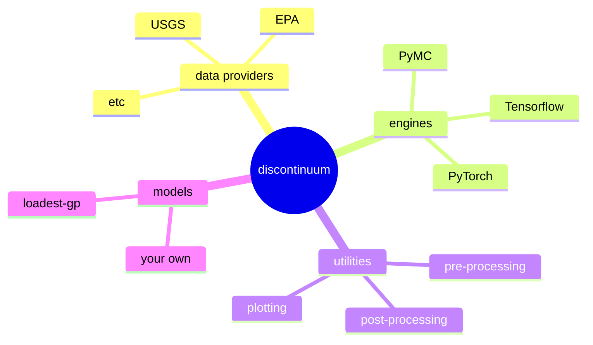

# discontinuum
> [!WARNING]  
> Experimental.

## Overview
`discontinuum` is a middleware for developing Gaussian process (GP) timeseries models.
Why might we want a middleware? 
GP's are an elegant way to model timeseries with uncertainty.
In many cases, we can represent a complex timeseries as a GP with only a few lines of math.
However, fitting GP's is numerically intense, $\mathcal{O}(n^3)$ complexity.
There are several optimizations that take advantage of simplifying assumptions, different algorithms, or GPUs,
but each has different tradeoffs.
Ideally, we could write the mathematical model once, then run it on whichever "engine" is best suited for a particular problem.
With every model comes a lot of standard utility functions,
and the goal of `discontinuum` is to package these different model applications, engines, and utilities into a single ecosystem.

## Installation
```
pip install discontinuum
```

## Models
Only one for now.

### loadset-gp
LOAD ESTimator (LOADEST) is a software program for estimating river constituent timeseries using surrogate variables (covariates).
For example, to estimate nitrate concentration based on date and flow.
However, LOADEST has several serious limitations---it's essentially a linear regression---
and it has been all but replaced by the more flexible Weighted Regression on Time Discharge and Season (WRTDS),
which allows the relation between target and covariate to vary through time.
`loadest-gp` takes the WRTDS idea and reimplements it as a GP.

```python
from loadest_gp import LoadestGP()

model = LoadestGP()
model.fit(target, covariates)
model.plot(covariates)
```

## Engines
Currently, the only engine is `pymc`'s marginal likelihood implementation.

## Roadmap

